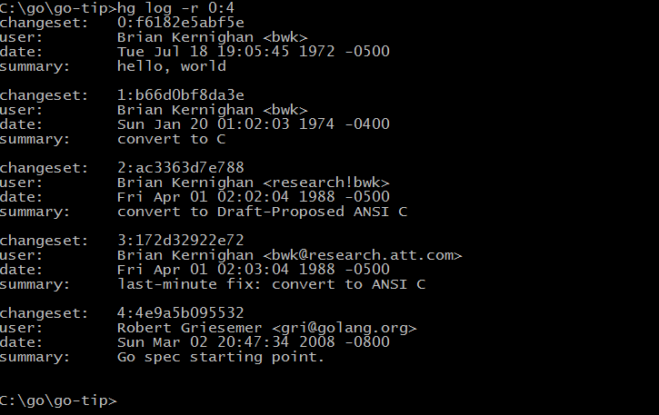

# 1.1 Go Language Genesis

The Go language was originally designed and invented in 2007 by three big guns at Google, Robert Griesemer, Ken Thompson, and Rob Pike. The initial flood of ideas for designing the new language came from a blown-out report of disdain for the super-complex C++11 features, with the ultimate goal of designing C for the web and multi-core era. By mid-2008, most of the language's features were designed and work began on implementing a compiler and runtime, with Russ Cox joining as the lead developer around this year. By 2009, the Go language had gradually stabilized. In September of that year, Go was officially released and the code was open sourced.

Go is often described as a "C-like language" or a "C language for the 21st century". From various perspectives, Go does inherit similar programming ideas from C, such as expression syntax, control flow structures, basic data types, call-parameter passing, pointers, and so on, as well as thoroughly inheriting and carrying forward C's simple and straightforward violent programming philosophy. Figure 1-1 shows the genetic mapping of the Go language given in the Go Language Bible, from which we can see what programming languages have influenced the Go language.


* Figure 1-1 Go language genetic family tree*.

First look at the left side of the genealogy tree. You can clearly see that the concurrency feature of Go language evolved from the CSP theory published by Hoare of Bell Labs in 1978. Subsequently, the CSP concurrency model was gradually refined and moved towards practical applications in programming languages such as Squeak/NewSqueak and Alef, and eventually these design lessons were digested and absorbed into the Go language. The concurrent programming model of the Erlang programming language, which is more familiar to the industry, is also another implementation of the CSP theory.

Let's look at the middle branch of the genetic map. The middle branch contains the evolution of object-oriented and package-oriented features of Go, which are inherited from the Pascal language designed by Niklaus Wirth and the related programming languages that followed. The syntax of package concepts, package import and declaration is mainly from Modula-2, and the syntax of method declarations provided by the object-oriented features is from the Oberon programming language. Eventually the Go language evolved its own unique implicit interface that supports the duck object-oriented model and many other features.

Finally, the right-hand side of the genetic map is a tribute to C. Go is the most radical abandonment of C, not only in terms of syntax but also in terms of abandoning the flexible but dangerous pointer operations of C. Moreover, Go has redesigned the priorities of some of the less sensible operators in C, and has made the necessary changes in many subtle ways. Of course, the violent programming philosophy of C, where less is more and simple is straightforward, is more thoroughly carried forward by Go (Go has only 25 keywords, and the sepc language specification is less than 50 pages long).

Other features of Go are scattered from other programming languages; iota syntax is borrowed from APL, lexical scopes and nested functions from Scheme (and many other programming languages), and Go has many of its own innovative designs. For example, Go's slicing provides efficient random access performance for lightweight dynamic arrays, which may be reminiscent of the underlying sharing mechanism of a linked table. There is also the Go language's newly invented defer statement (invented by Ken) which is a godsend.

## 1.1.1 Unique genes from Bell Labs

The signature concurrent programming feature of Go comes from Tony Hoare's 1978 paper on the foundations of concurrency research: communicating sequential processes (CSP), a little-known work by Tony Hoare at Bell Labs. Tony Hoare's CSP concurrency model is simply a descriptive language for describing the basic concepts of concurrency, not a general programming language for writing executable programs.

The most classic practical application of the CSP concurrency model comes from the Erlang programming language, invented by Ericsson. But while Erlang was using CSP theory as a concurrent programming model, Rob Pike, also from Bell Labs, and his colleagues were constantly trying to introduce the CSP concurrency model into the then newly invented programming languages. Their first attempt to introduce CSP concurrency features was a programming language called Squeak (the mouse's cry), a programming language used to provide mouse and keyboard event handling in which pipes were created statically. Newsqueak is a purely functional language with garbage collection, and it again targets keyboard, mouse and window event management. But in the Newsqueak language pipes are already created dynamically and they belong to the first class of values and can be saved in variables. Then came the Alef programming language (Alef was also the programming language favored by Ritchie, the father of C), which tried to transform Newsqueak into a system programming language, but the lack of a garbage collection mechanism made concurrent programming painful (this was also the price of inheriting C for manual memory management). After the Aelf language came a programming language called Limbo (for hell), a scripting language that runs in a virtual machine. the Limbo language is the closest ancestor to Go, and it shares the closest syntax to Go. By the time the Go language was designed, Rob Pike had accumulated decades of experience in the CSP concurrent programming model, and the features of concurrent programming in the Go language were completely at his fingertips, and the arrival of the new programming language was a natural fit.

Figure 1-2 shows the most direct evolutionary history that can be seen in the Go language library's early codebase logs (Git is viewed with the `git log --before={2008-03-03} --reverse` command).



* Figure 1-2 Go language development log*.

It is also clear from the early commit logs that the Go language evolved gradually from the B language invented by Ken Thompson and the C language invented by Dennis M. Ritchie. It is first and foremost a member of the C family of languages, so many people refer to the Go language as the C language of the 21st century.

Figure 1-3 shows the evolution of the concurrent programming genes unique to the Go language from Bell Labs.


*Figure 1-3 History of concurrency evolution in Go*.

Throughout the development process of Bell Labs programming languages, from B, C, Newsqueak, Alef, Limbo language all the way, Go language inherited half a century of software design genes coming from Bell Labs, and finally completed the mission of C language innovation. Throughout the past few years, Go language has become the most important basic programming language in the era of cloud computing and cloud storage.

## 1.1.2 Hello, World

By convention, the first program that introduces all programming languages is "Hello, World!". Although this tutorial assumes that the reader already knows Go, we do not want to break this convention (since it is a tradition inherited from its predecessor, C). The following code shows a Go program that outputs "Hello, World!" in Chinese. .

```Go
package main

import "fmt"

func main() {
	fmt.Println("Hello, 世界!")
}
```

Save the above code to a `hello.go` file. Since the code has non-ASCII Chinese characters, we need to explicitly specify the encoding of the file as BOM-free UTF8 (the UTF8 encoding of the source file is required by the Go language specification). Then go to the command line and switch to the directory where the `hello.go` file is located. For now we can use Go as a scripting language and run the program by typing `go run hello.go` directly from the command line. If everything works. You should see the output "Hello, world!" on the command line. on the command line.

Now, let's briefly introduce the program. All Go programs are made up of basic functions and variables, which are organized into individual Go source files, which are then organized into packages according to the author's intent, and which are then organically composed into a complete Go program. Among other things, functions are used to contain a series of statements (specifying the sequence of operations to be performed) and variables that store data when the operations are performed. The name of the function in our program is main, and although there are no restrictions on the names of functions in Go, the main function in the main package is the entry point for every executable by default. The package, on the other hand, is used to wrap and organize related functions, variables, and constants. Before we can use a package, we need to import it using the import statement. For example, we import the fmt package in this program (fmt is an abbreviation of the word format, which means formatting-related package), and then we can use the Println function in the fmt package.

And the double quotes containing "Hello, world!" is a string value constant in Go. Unlike strings in C, the contents of strings in Go are immutable. When a string is passed as an argument to the fmt.Println function, the content of the string is not copied-all that is passed is the address and length of the string (the structure of the string is defined in `reflect.StringHeader`). In Go, function arguments are passed by copy (no support for passing by reference) (more specifically, Go language closure functions are used by reference for external variables).

