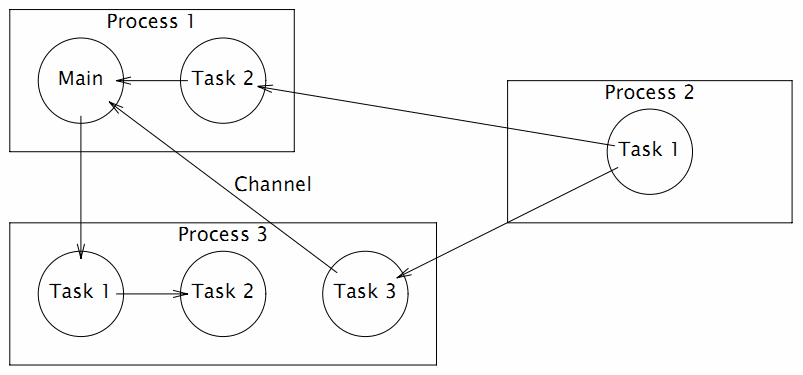

# 1.2 Revolution of Hello, World

In the Genesis chapter we briefly introduced the evolutionary genealogy of the Go language, highlighting the specific concurrent programming genes from Bell Labs, and finally introducing the Go language version of the "Hello, World" program. In fact, the "Hello, World" program is the best example of the characteristics of various languages, and is a window into the language. In this section, we will briefly review how the "Hello, World" program has evolved along the timeline of the evolution of each programming language to its current form in Go, and finally to its revolutionary mission.


*Figure 1-4 History of concurrency evolution in the Go language*

## 1.2.1 B Programming Language - Ken Thompson, 1972

First is the B language, a general-purpose programming language developed by Ken Thompson of Bell Labs, the father of the Go language, in the early years, designed to be used to assist in the development of UNIX systems. However, the lack of a flexible type system in the B language made it difficult to use. Later, Ken Thompson's colleague Dennis Ritchie developed the C language based on B. C provides a rich type system that greatly increases the expressiveness of the language. To this day it remains one of the most commonly used programming languages in the world. Since it was replaced by B, the language has existed only in the literature and has become history.

The B version of "Hello World" that we have seen so far is generally believed to be from the introductory B tutorial by Brian W. Kernighan (the first committer in the Go core code base is named Brian W. Kernighan), and the program is as follows.

```c
main() {
	extrn a, b, c;
	putchar(a); putchar(b); putchar(c);
	putchar('!*n');
}
a 'hell';
b 'o, w';
c 'orld';
```

Due to the lack of flexible data types in B, the only way to define what to output is with `a/b/c` global variables respectively, and the length of each variable must be aligned to 4 bytes (a feeling of writing assembly language). Then the characters are output by calling the `putchar` function several times, with the final `'! *n'` means output a newline.

Overall, the B language is simple and has relatively minimal functionality.

## 1.2.2 C Programming language - Dennis Ritchie, 1974 ~ 1989

The C language is arguably the most important software cornerstone of the modern IT industry, with almost all of the major operating systems and much of the underlying system software developed in C. The C family of The C family of programming languages has dominated for decades and has remained vibrant for more than half a century.

The first C version of the "Hello World" program appeared in an introductory C tutorial written by Brian W. Kernighan in about 1974. This provided the convention for most subsequent programming language tutorials to use "Hello World" as the first program. The first C version of the "Hello World" program was as follows.

```c
main()
{
	printf("hello, world");
}
```

There are a few things that need to be said about this program: firstly, the `main` function returns the `int` type by default because it does not specify the return value type; secondly, the `printf` function can be used by default without importing a function declaration; and finally, `main` does not specify a return statement, but returns a 0 value by default. At the time of this program, the C language was far from standardized, and what we see is the C syntax of the ancient times: functions did not have to write return values, function arguments could be ignored, no header files needed to be included when using printf, etc.

This example also appeared in the first edition of The C Programming Language, published in 1978 by Brian W. Kernighan and Dennis M. Ritchie (K&R for short). The book adds a newline output at the end of "Hello World".

```c
main()
{
	printf("hello, world\n");
}
```

This example adds a newline to the end of the string. The `\n` newline in C looks a little cleaner than the `'!*n'` newline looks a bit cleaner than the B language `'!

In 1988, 10 years after K&R's tutorial was released, the second edition of The C Programming Language was finally published. By this time, the ANSI C standardization draft had been preliminarily completed, but the official version of the document had not yet been released. The "Hello World" program in the book, however, added the `#include <stdio.h>` header file include statement to include the declaration of the `printf` function according to the new specification (in the new C89 standard, it is only for the `printf` function, which can still be be used directly without declaring a function).

```c
#include <stdio.h>

main()
{
	printf("hello, world\n");
}
```

Then in 1989, the first international standard for the ANSI C language was released, generally known as C89. C89 is one of the most popular C language standards and is still heavily used. The second edition of the C Programming Language was also printed again in a new version, and in response to the newly released C89 specification recommendations, a `void` input parameter description was added to the parameters of the `main` function, indicating that there were no input parameters.

```c
#include <stdio.h>

main(void)
{
	printf("hello, world\n");
}
```

At this point, the evolution of the C language itself is basically complete. The later C92/C99/C11 were only refined for some language details. Because of various historical factors, C89 is still the most widely used standard.


## 1.2.3 Newsqueak - Rob Pike, 1989

Newsqueak is the second generation of the mouse language invented by Rob Pike, the battleground he used to practice the CSP concurrent programming model. newsqueak stands for the new squeak language, where squeak is the mouse squeak, which can also be thought of as a mouse-click-like sound. squeak is a programming language that provides mouse and keyboard event handling Squeak is a programming language that provides mouse and keyboard event handling, and the pipes of the Squeak language are created statically. Newsqueak is a purely functional language with automatic garbage collection, again for keyboard, mouse and window event management. But in the Newsqueak language pipes are created dynamically and belong to the first class of values, so they can be saved to variables.

Newsqueak is a scripting language with a built-in `print` function, and its "Hello World" program is not very distinctive.

```go
print("Hello,", "World", "\n");
```

From the above program, it is difficult to see Newsqueak language-related features other than guessing that the `print` function can support multiple arguments. Since the main Newsqueak and Go language related features are concurrency and pipelines. Therefore, here we have a small glimpse of Newsqueak language features through a concurrent version of the "prime sieve" algorithm. The principle of the "prime sieve" is shown in the figure.


*Figure 1-5 The prime sieve*

The Newsqueak language concurrent version of the "prime number sieve" program is as follows.

```go
// Output a sequence of natural numbers starting from 2 to the pipe
counter := prog(c:chan of int) {
	i := 2;
	for(;;) {
		c <-= i++;
	}
};

// Filter out numbers that are multiples of prime for the listen pipeline
// New sequence output to send pipe
filter := prog(prime:int, listen, send:chan of int) {
	i:int;
	for(;;) {
		if((i = <-listen)%prime) {
			send <-= i;
		}
	}
};

// The main function
// The first outgoing number of each pipe must be a prime number
// Then build a new prime filter based on this new prime number
sieve := prog() of chan of int {
	c := mk(chan of int);
	begin counter(c);
	prime := mk(chan of int);
	begin prog(){
		p:int;
		newc:chan of int;
		for(;;){
			prime <-= p =<- c;
			newc = mk();
			begin filter(p, c, newc);
			c = newc;
		}
	}();
	become prime;
};

// Start the prime number sieve
prime := sieve();
```

The `counter` function is used to output the original sequence of natural numbers to the pipeline, and each `filter` function object corresponds to each new prime filter pipeline, which re-exports to the output pipeline after filtering the number series flowing into the input pipeline according to the current prime sieve. The `mk(chan of int)` is used to create the pipeline, similar to the `make(chan int)` statement in Go; the `begin filter(p, c, newc)` keyword starts the concurrent body of the prime sieve, similar to the `go filter(p, c, newc)` statement in Go; the `become` is used to return the result of a function, similar to the `return` statement.

The syntax of concurrent bodies and pipes in Newsqueak language is already relatively close to that of Go, and the syntax of posterior type declarations is similar to that of Go.

## 1.2.4 Alef - Phil Winterbottom, 1993

Before the advent of Go, Alef was the perfect concurrency language in the author's mind, and Alef syntax and runtime are basically seamlessly compatible with C. Alef language provides support for both thread and process concurrency bodies, where `proc receive(c)` is used to start a process and `task receive(c)` is used to start a thread and they communicate with each other through the pipe `c`. However, the lack of an automatic memory reclamation mechanism in Alef makes memory resource management for concurrent bodies exceptionally complex. Moreover, the Alef language was only briefly supported on Plan9 systems, and no other operating systems have a working Alef development environment. Moreover, there are only two publicly available documents for the Alef language, the Alef Language Specification and the Alef Programming Wizard, so there is not much discussion about the Alef language outside of Bell Labs.

The Alef language supports both process and thread concurrent bodies, and more concurrent bodies can be started again in the concurrent body, resulting in an unusually complex concurrency state for Alef. The Alef language inherits all the syntax of the C language and can be considered as the C language with enhanced concurrency syntax. The following figure shows a possible concurrent body state as shown in the Alef language documentation.



*Figure 1-6 Alef Concurrency Model*

The concurrent version of the "Hello World" program in Alef is as follows.

```c
#include <alef.h>

void receive(chan(byte*) c) {
	byte *s;
	s = <- c;
	print("%s\n", s);
	terminate(nil);
}

void main(void) {
	chan(byte*) c;
	alloc c;
	proc receive(c);
	task receive(c);
	c <- = "hello proc or task";
	c <- = "hello proc or task";
	print("done\n");
	terminate(nil);
}
```

The `#include <alef.h>` statement at the beginning of the program is used to include the runtime library for the Alef language. `receive` is a general function that is used as the entry function for each concurrent body in the program; the `alloc c` statement in the `main` function first creates a pipe of type `chan(byte*)`, similar to the Go language `make(chan []byte)` statement; then the `receive` function is started as a process and thread, respectively; after starting the concurrent body, the `main` function sends two strings to the `c` pipe. function; after starting the concurrent body, the `main` function sends two strings of data to the `c` pipe; the `receive` functions running in the process and thread states receive the data from the pipe in an indeterminate order and then print the strings separately; finally each concurrent body ends itself by calling `terminate(nil)`.

Alef's syntax remains basically the same as that of C. It can be thought of as adding concurrent programming-related features to the syntax of C, and can be seen as another dimension of C++.

## 1.2.5 Limbo - Sean Dorward, Phil Winterbottom, Rob Pike, 1995

Limbo is a programming language for developing distributed applications running on small computers. it supports modular programming, strong type checking at compile time and runtime, in-process type-based communication pipelines, atomic garbage collection, and simple abstract data types. limbo is designed to: run safely even on small devices that are not protected by hardware memory. The Limbo language runs primarily on top of Inferno systems.

The Limbo language version of the "Hello World" program is as follows.

```go
implement Hello;

include "sys.m"; sys: Sys;
include "draw.m";

Hello: module
{
	init: fn(ctxt: ref Draw->Context, args: list of string);
};

init(ctxt: ref Draw->Context, args: list of string)
{
	sys = load Sys Sys->PATH;
	sys->print("hello, world\n");
}
```

From this version of the "Hello World" program, we can already see the beginnings of many Go language features. The first sentence `implement Hello;` basically corresponds to the Go language `package Hello` package declaration statement. Then comes the `include "sys.m"; sys: Sys;` and `include "draw.m";` statements for importing other modules, similar to Go's `import "sys"` and `import "draw"` statements. Then the Hello package module also provides the module initialization function `init`, and the type of the function's arguments is also posterior, although the Go language's initialization function has no arguments.

## 1.2.6 Go Language - 2007~2009

Bell Labs has since undergone a number of upheavals, with the original Plan9 project team, including Ken Thompson, eventually joining Google. More than 10 years after the birth of predecessor languages such as Limbo, the three original authors of the Go language finally took 20% of their free time to create the Go language at the end of 2007 when they got together by chance to criticize C++ (legend has it that the C++ language evangelist had completely pissed them off with all the awesome features of C++11 that he was advocating everywhere at Google). The initial Go language specification was written in March 2008, and the initial Go programs were compiled directly into C and then secondarily into machine code. By May 2008, the leaders of Google finally realized the great potential of the Go language and thus began to fully support the project (Google's founders even contributed the `func` keyword), allowing them to devote their full working time to the design and development of the Go language. After the first version of the Go language specification was completed, the Go language compiler was finally able to generate machine code directly.

### 1.2.6.1 hello.go - June 2008

```go
package main

func main() int {
	print "hello, world\n";
	return 0;
}
```

This is the version of the initial Go language program that officially started testing. The built-in `print` statement for debugging is already there, but it is used in a command-like manner. The entry `main` function also returns a value of type `int`, just like the `main` function in C, and requires `return` to return the value explicitly. The semicolon at the end of each statement is also still present.

### 1.2.6.2 hello.go - June 27, 2008

```go
package main

func main() {
	print "hello, world\n";
}
```

The entry function `main` has been stripped of its return value, and the program returns by default with an implicit call to `exit(0)`. The Go language is evolving towards simplicity.

### 1.2.6.3 hello.go - August 11, 2008

```go
package main

func main() {
	print("hello, world\n");
}
```

The built-in `print` for debugging has been changed from a starting command to a normal built-in function, making the syntax simpler and more consistent.

### 1.2.6.4 hello.go - October 24, 2008

```go
package main

import "fmt"

func main() {
	fmt.printf("hello, world\n");
}
```

The `printf` formatting function, which is the signature of C, has been ported to Go, and the function is placed in the `fmt` package (`fmt` is an abbreviation for the formatting word `format`). However, the beginning letters of the `printf` function names are still lowercase, and the feature of using uppercase letters to indicate export has not yet appeared.

### 1.2.6.5 hello.go - January 15, 2009

```go
package main

import "fmt"

func main() {
	fmt.Printf("hello, world\n");
}
```

The Go language started using case initials to distinguish whether symbols can be exported or not. Upper case initials indicate public symbols that are exported, and lower case initials indicate private symbols inside the package. Chinese users should note that there is no concept of upper and lower case letters in Chinese characters, so symbols starting with Chinese characters cannot be exported at the moment (Chinese users have given suggestions for this problem, and the export rules for Chinese characters may be adjusted after Go2).

### 1.2.6.7 hello.go - December 11, 2009

```go
package main

import "fmt"

func main() {
	fmt.Printf("hello, world\n")
}
```

Go has finally removed the semicolon from the end of its statements. This is the first major syntax improvement since the Go language was officially opened source on November 10, 2009. It has taken the authors of Go 32 years to remove the semicolon from the end of a statement, since 1978, when the first version of the C tutorial introduced the semicolon splitting rule. The evolution of this 32-year process must have been full of gossip, and I think it must have been the result of careful consideration by the designers of the Go language (new languages such as Swift now also ignore the semicolon by default, so the semicolon is really not that important).

## 1.2.7 你好, 世界! - V2.0

After half a century of rebirth, the Go language not only prints the Unicode version of "Hello, World", but also makes it easy to provide printing services to users worldwide. The following version prints the Chinese "Hello, World!" and the current time information to each visiting client via the `http` service. and the current time information.

```go
package main

import (
	"fmt"
	"log"
	"net/http"
	"time"
)

func main() {
	fmt.Println("Please visit http://127.0.0.1:12345/")
	http.HandleFunc("/", func(w http.ResponseWriter, req *http.Request) {
		s := fmt.Sprintf("你好, 世界! -- Time: %s", time.Now().String())
		fmt.Fprintf(w, "%v\n", s)
		log.Printf("%v\n", s)
	})
	if err := http.ListenAndServe(":12345", nil); err != nil {
		log.Fatal("ListenAndServe: ", err)
	}
}
```

We construct a standalone http service from the `net/http` package that comes with the Go language standard library. Where `http.HandleFunc("/", ...) ` registers the response handler function for the `/` root path request. In the response handler function, we still use the `fmt.Fprintf` formatted output function to implement the http protocol to print the formatted string to the requesting client, and also print the relevant string on the server side via the standard library's logging package. Finally, the http service is started by a `http.ListenAndServe` function call.

At this point, Go has finally completed its metamorphosis from a single-computer, single-core era C language to a general-purpose programming language for the 21st century Internet era multi-core environment.
