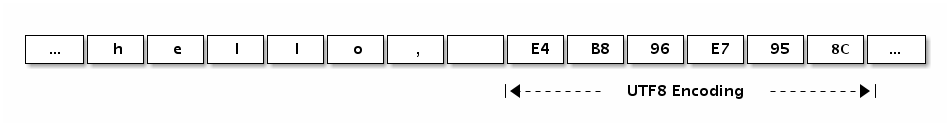

# 1.3 Arrays, Strings, and Slices

Arrays and their related data structures are the most frequently used in mainstream programming languages, with chained tables, hash tables (which can be thought of as a hybrid of arrays and chains) and more complex custom data structures being considered only when it(s) does not suffice.

The three closely related data structures in the Go language are arrays, strings and slices. These three data types have the same memory structure for raw data at the bottom level, and different behaviors at the top level due to syntax constraints. First, Go arrays are value types, and although the elements of an array can be modified, the array itself is treated as a copy of the whole for assignments and function pass-throughs. String assignments only copy the data address and corresponding length, and do not result in a copy of the underlying data. The behavior of slices is more flexible; the structure of a slice is similar to that of a string, but with the read-only restriction lifted. The underlying data of a slice is also an array of corresponding data types, but each slice has its own length and capacity information, and the slice header information is treated as a value when the slice is assigned and the function is passed. Because the slice header contains a pointer to the underlying data, its assignment does not result in a copy of the underlying data. In fact, Go's assignment and function passing rules are very simple. Except for closures, which access external variables by reference, all other assignments and function passing arguments are handled as value passing. Understanding the reason for the three different ways of handling arrays, strings, and slices requires a detailed understanding of their underlying data structures.

## 1.3.1 Arrays

An array is a sequence of elements of a specific type of fixed length. An array can consist of zero or more elements. The length of an array is a component of the array type. Because the length of an array is a part of the array type, arrays of different lengths or different types of data are of different types, so arrays are rarely used directly in the Go language (arrays of different lengths cannot be assigned directly because they are of different types). Slices are sequences that can be dynamically grown and shrunk. Slices are also more flexible, but to understand how slices work you need to understand arrays first.

Let's take a look at how arrays are defined:

```go
var a [3]int // Define an int array of length 3, with all elements being 0
var b = [...] int{1, 2, 3} // defines an int array of length 3, with elements 1, 2, 3
var c = [...] int{2: 3, 1: 2} // defines an int array of length 3, with elements 0, 2, 3
var d = [...] int{1, 2, 4: 5, 6} // defines an int array of length 6, with elements 1, 2, 0, 0, 5, 6
```


The first way is the most basic way to define an array variable, where the length of the array is explicitly specified and each element of the array is initialized with a zero value.

The second way of defining an array allows you to specify the initialization values of all elements in order at the time of definition, and the length of the array is automatically calculated based on the number of initialized elements.

The third way is to initialize the elements of the array by indexing, so the initialization values of the elements appear in a more arbitrary order. This initialization method is similar to the initialization syntax of the `map[int]Type` type. The length of the array is determined by the index of the largest occurrence, and elements that are not explicitly initialized are still initialized with a value of 0.

The fourth way is a mixture of the second and third initialization methods, where the first two elements are initialized sequentially, the third and fourth elements are initialized with zero values, the fifth element is initialized by index, and the last element follows the previous fifth element using sequential initialization.

The memory structure of an array is relatively simple. For example, the following is the memory structure corresponding to an `[4]int{2,3,5,7}` array of values.


*Figure 1-7 Array layout*

Arrays in Go language are value semantics. An array variable, which means the entire array, is not an implicit pointer to the first element (as in C arrays), but a complete value. When an array variable is assigned or passed, the entire array is actually copied. If the array is large, the assignment of the array will also have a large overhead. To avoid the overhead of copying the array, you can pass a pointer to the array, but the array pointer is not the array.

```go
var a = [...] int{1, 2, 3} // a is an array
var b = &a // b is a pointer to an array

fmt.Println(a[0], a[1]) // print the first 2 elements of the array
fmt.Println(b[0], b[1]) // access the array elements through the array pointer in a similar way to an array

for i, v := range b { // iterate through the elements of the array via the array pointer
	fmt.Println(i, v)
}
```

where `b` is a pointer to the `a` array, but accessing the elements of the array through `b` is written in a similar way to `a`. It is also possible to iterate over the elements of the array pointed by the array pointer by using `for range`. In fact, except for the fact that the type of the array pointer is different from that of the array, the operation of the array through the array pointer is similar to the operation of the array itself, and only one pointer is copied when the array pointer is assigned. However, the array pointer type is still not flexible enough because the length of the array is part of the array type, and the types of array pointers to arrays of different lengths are completely different.

You can think of an array as a special structure, where the field names correspond to the indexes of the array, and the number of members of the structure is fixed. The built-in function `len` can be used to calculate the length of the array, and the `cap` function can be used to calculate the capacity of the array. However, for array types, the `len` and `cap` functions always return the same result, both corresponding to the length of the array type.

We can use `for` loops to iterate over arrays. The following common ways can be used to iterate through arrays.

```go
	for i := range a {
		fmt.Printf("a[%d]: %d\n", i, a[i])
	}
	for i, v := range b {
		fmt.Printf("b[%d]: %d\n", i, v)
	}
	for i := 0; i < len(c); i++ {
		fmt.Printf("c[%d]: %d\n", i, c[i])
	}
```

Iterating in the `for range` way may have better performance, because it is guaranteed that no array bounds will occur, and accesses to array elements in each iteration will eliminate the need to determine subscript bounds.

Iterating in the `for range` way also ignores subscripts at the time of iteration:

```go
	var times [5][0]int
	for range times {
		fmt.Println("hello")
	}
```

The `times` corresponds to an array of type `[5][0]int`, although the first dimensional array has length, the element `[0]int` of the array has size 0, so the memory size occupied by the whole array is still 0. Without paying extra memory cost, we achieve `times` fast iteration by `for range`.

Arrays can be used not only for numeric types, but also for defining string arrays, structure arrays, function arrays, interface arrays, pipe arrays, etc.

```go
// string array
var s1 = [2]string{"hello", "world"}
var s2 = [...]string{"你好", "世界"}
var s3 = [...]string{1: "世界", 0: "你好", }

// struct array
var line1 [2]image.Point
var line2 = [...]image.Point{image.Point{X: 0, Y: 0}, image.Point{X: 1, Y: 1}}
var line3 = [...]image.Point{{0, 0}, {1, 1}}

// decoder array
var decoder1 [2]func(io.Reader) (image.Image, error)
var decoder2 = [...]func(io.Reader) (image.Image, error){
	png.Decode,
	jpeg.Decode,
}

// interface array
var unknown1 [2]interface{}
var unknown2 = [...]interface{}{123, "你好"}

// channel array
var chanList = [2]chan int{}
```

We can also define an empty array.

```go
var d [0]int // Define an array of length 0
var e = [0]int{} // Define an array of length 0
var f = [...] int{} // Define an array of length 0
```

Arrays of length 0 do not occupy space in memory. Empty arrays, although rarely used directly, can be used to avoid allocating additional memory space when emphasizing a specific type of operation, such as for synchronous operations on pipes.

```go
	c1 := make(chan [0]int)
	go func() {
		fmt.Println("c1")
		c1 <- [0]int{}
	}()
	<-c1
```

Here, we do not care about the real type of data transferred in the pipeline, where the pipeline receive and send operations are only used for message synchronization. For this scenario, we can reduce the overhead of pipeline element assignment by using an empty array as the pipeline type. Of course it is generally preferable to use untyped anonymous structs instead.

```go
	c2 := make(chan struct{})
	go func() {
		fmt.Println("c2")
		c2 <- struct{}{} // The struct{} part is the type, {} means the corresponding structure value
	}()
	<-c2
```

We can use the `%T` or `%#v` predicate syntax provided by the `fmt.Printf` function to print the type and details of the array.

```go
	fmt.Printf("b: %T\n", b)  // b: [3]int
	fmt.Printf("b: %#v\n", b) // b: [3]int{1, 2, 3}
```

In Go, array types are the basis for structures such as slices and strings. Many of the above operations on arrays can be used directly in strings or slices.

## 1.3.2 Strings

A string is an immutable sequence of bytes, and strings are typically used to contain human-readable text data. Unlike an array, the elements of a string are not modifiable and are a read-only array of bytes. The length of each string is not part of the string type, although the length of each string is also fixed. The source code requirements of the Go language are UTF8 encoded, resulting in string-value constants that appear in Go source code being generally UTF8 encoded as well. Text strings in source code are typically interpreted as sequences of Unicode code points (runes) using UTF8 encoding. Because byte sequences correspond to read-only byte sequences, strings can contain arbitrary data, including the byte value 0. We can also use strings to represent non-UTF8 encoded data such as GBK, but it is more accurate to think of a string as a read-only binary array, since syntax such as `for range` does not support traversal of non-UTF8 encoded strings .

The underlying structure of Go language strings is defined in `reflect.StringHeader`.

```go
type StringHeader struct {
	Data uintptr
	Len  int
}
```

The string structure consists of two pieces of information: the first is the underlying byte array to which the string points, and the second is the length of the string's bytes. The string is actually a structure, so the string assignment operation is also a copy of the `reflect.StringHeader` structure, and does not involve a copy of the underlying byte array. The underlying structure of the `[2]string` array mentioned in the previous section on arrays is the same as the underlying structure of `[2]reflect.StringHeader`, which can be viewed as an array of structures.

We can look at the memory structure of the string "Hello, world" itself.


*Figure 1-8 String Layout*

It shows that the underlying data of the "Hello, world" string is identical to the following array.

```go
var data = [...]byte{
	'h', 'e', 'l', 'l', 'o', ',', ' ', 'w', 'o', 'r', 'l', 'd',
}
```

Strings are not slices, but they support slicing operations, and the same block of memory data is accessed at the bottom of slices at different locations (since strings are read-only, the same string literal constant usually corresponds to the same string constant).

```go
s := "hello, world"
hello := s[:5]
world := s[7:]

s1 := "hello, world"[:5]
s2 := "hello, world"[7:]
```

Strings are similar to arrays in that the built-in `len` function returns the length of the string. The length of a string can also be accessed via the `reflect.StringHeader` structure (this is just to demonstrate the structure of a string and is not a recommended practice).

```go
fmt.Println("len(s):", (*reflect.StringHeader)(unsafe.Pointer(&s)).Len)   // 12
fmt.Println("len(s1):", (*reflect.StringHeader)(unsafe.Pointer(&s1)).Len) // 5
fmt.Println("len(s2):", (*reflect.StringHeader)(unsafe.Pointer(&s2)).Len) // 5
```

According to the Go language specification, Go source files are encoded in UTF8. Therefore, string-value constants appearing in Go source files are also generally UTF8 encoded (there is no such restriction for escaped characters). When referring to Go strings, we generally assume that the string corresponds to a legal sequence of UTF8-encoded characters. This can be printed directly with the built-in `print` debugging function or the `fmt.Print` function, or you can use a `for range` loop to directly iterate through the UTF8 decoded Unicode code point values.

The following `Hello, World` string contains Chinese characters and can be printed as a byte type to see the underlying data of the characters.

```go
fmt.Printf("%#v\n", []byte("Hello, 世界"))
```

Output is:

```go
[]byte{0x48, 0x65, 0x6c, 0x6c, 0x6f, 0x2c, 0x20, 0xe4, 0xb8, 0x96, 0xe7, \
0x95, 0x8c}
```

We can see that `0xe4, 0xb8, 0x96` corresponds to the Chinese word "世" and `0xe7, 0x95, 0x8c` corresponds to the Chinese word "界". We can also specify the UTF8 encoded value in the string value (the source file is all ASCII, which can avoid multi-byte characters).

```go
fmt.Println("\xe4\xb8\x96") // output: 世
fmt.Println("\xe7\x95\x8c") // output: 界
```

The following figure shows the layout of the memory structure for the string "Hello, 世界":



*Figure 1-9 String Layout*

Go language strings can hold arbitrary sequences of binary bytes, and even UTF8 character sequences may encounter bad encoding. If an incorrect UTF8 encoding input is encountered, a special Unicode character '\uFFFD' will be generated, which may not appear the same in different software. In print this symbol is usually a black hexagon or diamond shape containing a white question mark '�'.

In the following string, we have intentionally damaged the second and third bytes of the first character, so the first character will be printed as "�" and the second and third bytes will be ignored, and the next "abc" will still be decoded and printed normally (one of the excellent features of UTF8 encoding is that the wrong encoding will not spread backwards).

```go
fmt.Println("\xe4\x00\x00\xe7\x95\x8cabc") // �界abc
```

However, when `for range` iterates over this corrupted UTF8 string, the second and third bytes of the first character are still iterated over separately, but then the value of the iteration is the corrupted 0:

```go
for i, c := range "\xe4\x00\x00\xe7\x95\x8cabc" {
	fmt.Println(i, c)
}
// 0 65533  // \uFFFD, 对应 �
// 1 0      // 空字符
// 2 0      // 空字符
// 3 30028  // 界
// 6 97     // a
// 7 98     // b
// 8 99     // c
```

If you don't want to decode the UTF8 string and want to traverse the original bytecode directly, you can force the string into a `[]byte` byte sequence before traversing it (the conversion here generally does not incur runtime overhead):.

```go
for i, c := range []byte("世界abc") {
	fmt.Println(i, c)
}
```

Or, to traverse the byte array of strings using the traditional subscripting method.

```go
const s = "\xe4\x00\x00\xe7\x95\x8cabc"
for i := 0; i < len(s); i++ {
	fmt.Printf("%d %x\n", i, s[i])
}
```

Go provides special support for interconverting strings and `[]rune` types, in addition to the `for range` syntax that provides special support for UTF8 strings.

```go
fmt.Printf("%#v\n", []rune("世界"))      		// []int32{19990, 30028}
fmt.Printf("%#v\n", string([]rune{'世', '界'})) // 世界
```

From the output of the above code, we can see that `[]rune` is actually of type `[]int32`, where `rune` is just an alias for type `int32` and not a redefined type. `rune` is used to represent each Unicode code point, and currently only 21 bit bits are used.

String-related forced type conversions mainly involve the types `[]byte` and `[]rune`. Each of these conversions may imply a memory reallocation cost, and in the worst case they both have an operational time complexity of `O(n)`. However, the string and `[]rune` conversions are a bit more special, because generally such forced type conversions require that the underlying memory structures of the two types be as consistent as possible, and obviously their underlying `[]byte` and `[]int32` types have completely different internal layouts, so this conversion may imply a memory reallocation operation.

The following is a simple pseudo-code simulation of some of the built-in operations on strings in Go, respectively, so that the time complexity and space complexity of processing each operation will be more clearly understood

**`for range` iterative simulation of string implementation**

```go
func forOnString(s string, forBody func(i int, r rune)) {
	for i := 0; len(s) > 0; {
		r, size := utf8.DecodeRuneInString(s)
		forBody(i, r)
		s = s[size:]
		i += size
	}
}
```

When `for range` iterates over strings, it decodes one Unicode character at a time and then enters the `for` loop body; encountering a crashing encoding does not cause the iteration to stop.

**`[]byte(s)` conversion simulation implementation**

```go
func str2bytes(s string) []byte {
	p := make([]byte, len(s))
	for i := 0; i < len(s); i++ {
		c := s[i]
		p[i] = c
	}
	return p
}
```

The simulation implementation creates a new slice and then copies the array of strings one by one into the slice, which is to ensure the read-only semantics of strings. Of course, when converting strings to `[]byte`, the compiler may directly return the underlying data corresponding to the original string if the converted variable is not modified by the case.

**`string(bytes)` conversion simulation implementation**

```go
func bytes2str(s []byte) (p string) {
	data := make([]byte, len(s))
	for i, c := range s {
		data[i] = c
	}

	hdr := (*reflect.StringHeader)(unsafe.Pointer(&p))
	hdr.Data = uintptr(unsafe.Pointer(&data[0]))
	hdr.Len = len(s)

	return p
}
```

Because Go strings are read-only, it is not possible to construct the underlying byte array directly to generate a string. In the mock implementation, the underlying data structure of the string is obtained through the `unsafe` package, and then the sliced data is copied one by one into the string, again to ensure that the read-only semantics of the string is not affected by the slicing. If the original `[]byte` variables do not change during the life cycle of the converted string, the compiler may build the string directly based on the `[]byte` underlying data.

**`[]rune(s)` conversion simulation implementation**

```go
func str2runes(s string) []rune{
	var p []int32
	for len(s)>0 {
        r,size:=utf8.DecodeRuneInString(s)
        p=append(p,int32(r))
        s=s[size:]
        }
        return []rune(p)
}
```

Because of the difference in the underlying memory structure, the string-to-`[]rune` conversion necessarily results in reallocating the `[]rune` memory space and then decoding and copying the corresponding Unicode code point values in turn. This forced conversion does not have the optimization case mentioned earlier when converting strings and byte slices.

**`string(runes)` conversion simulation implementation**

```go
func runes2string(s []int32) string {
	var p []byte
	buf := make([]byte, 3)
	for _, r := range s {
		n := utf8.EncodeRune(buf, r)
		p = append(p, buf[:n]...)
	}
	return string(p)
}
```

Also because of differences in the underlying memory structure, the `[]rune` to string conversion necessarily results in a reconstructed string. This forced conversion does not have the optimization case mentioned earlier.

## 1.3.3 Slice

Simply put, a slice is a simplified version of a dynamic array. Because the length of a dynamic array is not fixed, the length of a slice naturally cannot be a component of the type. While arrays have their place, they are not flexible enough in terms of type and operation, so they are not used much in Go code. Slices, on the other hand, are used quite extensively, and understanding the principles and usage of slices is a necessary skill for a Go programmer.

Let's look at the structure definition of the slice, `reflect.SliceHeader`.

```go
type SliceHeader struct {
	Data uintptr
	Len  int
	Cap  int
}
```

You can see that the beginning of the slice is the same as the Go string, but the slice has an additional `Cap` member indicating the maximum capacity of the memory space pointed to by the slice (the number of elements corresponding to it, not the number of bytes). The following figure shows the memory structure of `x := []int{2,3,5,7,11}` and `y := x[1:3]` slices.


*Figure 1-10 Slice layout*

Let's see what ways slices can be defined.

```go
var (
	a []int // nil slice, equal to nil, generally used to represent a non-existent slice
	b = []int{} // empty slice, not equal to nil, generally used to represent an empty set
	c = []int{1, 2, 3} // slice with 3 elements, len and cap are both 3
	d = c[:2] // slice with 2 elements, len is 2, cap is 3
	e = c[0:2:cap(c)] // slice with 2 elements, len is 2, cap is 3
	f = c[:0] // slice with 0 elements, len is 0, cap is 3
	g = make([]int, 3) // slice with 3 elements, len and cap are both 3
	h = make([]int, 2, 3) // slice with 2 elements, len is 2, cap is 3
	i = make([]int, 0, 3) // slice with 0 elements, len is 0, cap is 3
)
```

As with arrays, the built-in `len` function returns the length of the valid elements in the slice, and the built-in `cap` function returns the slice capacity size, which must be greater than or equal to the length of the slice.The slice information can also be accessed via the `reflect.SliceHeader` structure (just to illustrate the structure of the slice, not a recommended practice).  Slices can be compared with `nil`, and the length and capacity information of a slice will be invalid only if the slice itself is `nil` when the slice's underlying data pointer is empty. If there is a case where the bottom data pointer of the slice is empty, but the length and capacity are not 0, then the slice itself is corrupted (e.g. the slice has been modified incorrectly directly by the `reflect.SliceHeader` or `unsafe` package).

Slices are traversed in a similar way to arrays.

```go
	for i := range a {
		fmt.Printf("a[%d]: %d\n", i, a[i])
	}
	for i, v := range b {
		fmt.Printf("b[%d]: %d\n", i, v)
	}
	for i := 0; i < len(c); i++ {
		fmt.Printf("c[%d]: %d\n", i, c[i])
	}
```

In fact, except for traversal, traversal of slices, reading and modification of elements are the same as arrays, as long as the underlying data pointers, length and capacity of slices do not change. When assigning values or passing parameters to the slice itself, the operation is similar to that of an array pointer, only the slice header information (`reflect.SliceHeader`) is copied, and not the underlying data. For types, the main difference with arrays is that the type of a slice is independent of the length information, as long as the elements of the same type form a slice of the same slice type.

As mentioned before, slicing is a simplified version of dynamic arrays, which is the soul of the slicing type. In addition to constructing slices and traversing slices, adding sliced elements and deleting sliced elements are problems frequently encountered in slicing processing.

**Add slice element**

The built-in generic function `append` can append `N` elements to the end of a slice.

```go
var a []int
a = append(a, 1) // append 1 element
a = append(a, 1, 2, 3) // append multiple elements, handwritten unpacking
a = append(a, []int{1,2,3}...) // append a slice, the slice needs to be unwrapped
```

Note, however, that in the case of insufficient capacity, the `append` operation will result in a reallocation of memory, which may result in a significant memory allocation and cost of copying data. Even if there is enough capacity, it is still necessary to update the slice itself with the return value of the `append` function, because the length of the new slice has changed.

In addition to appending at the end of the slice, we can also add elements at the beginning of the slice:

```go
var a = []int{1,2,3}
a = append([]int{0}, a...)        // add 1 element at the beginning
a = append([]int{-3,-2,-1}, a...) // add 1 slice to the beginning
```

At the beginning generally results in memory reallocation and causes all existing elements to be copied 1 time. Therefore, the performance of adding elements from the beginning of a slice is generally much worse than that of appending elements from the end.

Since the `append` function returns a new slice, that is, it supports chain operations. We can combine multiple `append` operations to achieve inserting elements in the middle of a slice.

```go
var a []int
a = append(a[:i], append([]int{x}, a[i:]...) ...)     // insert x at position i
a = append(a[:i], append([]int{1,2,3}, a[i:]...) ...) // insert slice at position i
```

The second `append` call in each add operation creates a temporary slice, copies the contents of `a[i:]` to the newly created slice, and then appends the temporarily created slice back to `a[:i]`.

The creation of intermediate temporary slices can be avoided with the combination of `copy` and `append`, which also completes the operation of adding elements.

```go
a = append(a, 0) // slice to expand 1 space
copy(a[i+1:], a[i:]) // a[i:] is moved back 1 position
a[i] = x // set the newly added element
```

The first clause `append` is used to extend the length of the slice, leaving space for the element to be inserted. The second `copy` operation moves the element after the start of the position to be inserted back one position. The third sentence literally assigns the newly added element to the corresponding position. The operation statement is a bit longer, but it reduces the number of temporary slices created in between compared to the previous method.

The combination of `copy` and `append` can also be used to insert multiple elements in the middle (i.e., insert a slice):

```go
a = append(a, x...)       // expand enough space for x slices
copy(a[i+len(x):], a[i:]) // move a[i:] back by len(x)
copy(a[i:], x) // copy the newly added slice
```

A slight shortcoming is that the copying of elements in the extended space part is not necessary when extending the slice capacity in the first sentence. There is no dedicated built-in function for extending the slice capacity, `append` is essentially for appending elements rather than extending the capacity, and extending the slice capacity is just a side effect of `append`.

**Delete sliced elements**

There are three cases depending on the position of the element to be deleted: deleting from the beginning position, deleting from the middle position, and deleting from the tail. Among them, the elements at the end of the slice are deleted the fastest.

```go
a = []int{1, 2, 3}
a = a[:len(a)-1] // delete the trailing 1 element
a = a[:len(a)-N] // delete the trailing N elements
```

Deleting an element at the beginning can be done by moving the data pointer directly.

```go
a = []int{1, 2, 3}
a = a[1:] // delete the first 1 elements
a = a[N:] // delete the first N elements
```

Deleting the beginning element can also be done without moving the data pointer, but moving the data that follows it toward the beginning. This can be done in-place with `append` (by in-place, we mean that it is done in the memory interval corresponding to the original sliced data and does not result in a change in the memory space structure).

```go
a = []int{1, 2, 3}
a = append(a[:0], a[1:]...) // Delete the first 1 element
a = append(a[:0], a[N:]...) // Delete the first N elements
```

The deletion of the opening element can also be done with `copy`:

```go
a = []int{1, 2, 3}
a = a[:copy(a, a[1:])] // delete the first 1 elements
a = a[:copy(a, a[N:])] // delete the first N elements
```

For deleting the middle element, an overall move of the remaining elements is required, again this can be done in situ with `append` or `copy`.

```go
a = []int{1, 2, 3, ...}

a = append(a[:i], a[i+1:]...) // Delete the middle 1 element
a = append(a[:i], a[i+N:]...) // delete the middle N elements

a = a[:i+copy(a[i:], a[i+1:])] // delete the middle 1 element
a = a[:i+copy(a[i:], a[i+N:])] // delete the middle N elements
```

Deleting the beginning element and deleting the end element can both be considered as special cases of the delete middle element operation.

**Slicing Memory Tips**

In the section on arrays at the beginning of this section we mentioned that there are empty arrays like `[0]int`, which are rarely used. But for slicing, slices with `len` of `0` but `cap` of non-`0` capacity are a very useful feature. Of course, if both `len` and `cap` are `0`, then it becomes a truly empty slice, although it is not a `nil`-valued slice. When determining whether a slice is empty or not, the length of the slice is usually obtained from `len`, and a direct comparison between the slice and the `nil` value is rarely made.

For example, the following `TrimSpace` function is used to remove spaces from `[]byte`. The function implementation takes advantage of the 0-length slicing feature for efficient and clean implementation.


```go
func TrimSpace(s []byte) []byte {
	b := s[:0]
	for _, x := range s {
		if x != ' ' {
			b = append(b, x)
		}
	}
	return b
}
```

In fact, similar algorithms for in situ deletion of sliced elements based on filtering conditions can be handled in a similar way (since it is a deletion operation that does not result in an out-of-memory situation).

```go
func Filter(s []byte, fn func(x byte) bool) []byte {
	b := s[:0]
	for _, x := range s {
		if !fn(x) {
			b = append(b, x)
		}
	}
	return b
}
```

The key point of slicing efficient operations is to reduce the number of memory allocations, try to ensure that `append` operations do not exceed the capacity of `cap`, and reduce the number of triggered memory allocations and the size of each allocated memory.

**Avoid slicing memory leaks**

As stated earlier, the slice operation does not copy the underlying data. The underlying array is kept in memory until it is no longer referenced. However, sometimes a small memory reference may cause the entire underlying array to be in a used state, which delays the automatic memory recycler's recovery of the underlying array.

For example, the `FindPhoneNumber` function loads the entire file into memory, then searches for the first occurrence of the phone number, and returns the final result as a slice.

```go
func FindPhoneNumber(filename string) []byte {
	b, _ := ioutil.ReadFile(filename)
	return regexp.MustCompile("[0-9]+").Find(b)
}
```

The `[]byte` returned by this code points to the array that holds the entire file. Because the slice references the entire original array, the automatic garbage collector cannot free the space of the underlying array in time. A small requirement may result in the need to save the entire file data for a long time. This, while this is not a memory leak in the traditional sense, may slow down the overall performance of the system.

To fix this, the data of interest can be copied into a new slice (the passing of data is a philosophy of Go language programming, and while there is a cost to passing values, the benefit in exchange is that the dependency on the original data is cut off).

```go
func FindPhoneNumber(filename string) []byte {
	b, _ := ioutil.ReadFile(filename)
	b = regexp.MustCompile("[0-9]+").Find(b)
	return append([]byte{}, b...)
}
```

A similar problem may be encountered when deleting sliced elements. Assuming that the slice holds a pointer object, then after the following deletion of the end element, the deleted element is still referenced by the array at the bottom of the slice, thus not being reclaimed in time by the automatic garbage collector (this depends on how the collector is implemented).

```go
var a []*int{ ... }
a = a[:len(a)-1] // The last element that was deleted is still referenced, which may cause the GC operation to be blocked
```

The safe way is to first set the element that needs to be automatically memory reclaimed to `nil` to ensure that the auto-reclaimer can find the object that needs to be reclaimed, and then perform the slice deletion operation.

```go
var a []*int{ ... }
a[len(a)-1] = nil // GC reclaims the last element of memory
a = a[:len(a)-1] // delete the last element from the slice
```

Of course, if the slice has a very short life span, you don't have to deal with this problem intentionally. If the slice itself can be reclaimed by GC, each element of the slice can be reclaimed naturally.

**Slice type forced conversion**

For safety, Go cannot directly convert types when the underlying primitive slice types of the two slice types `[]T` and `[]Y` are different. But safety comes at a price, and sometimes this conversion has its value - it can simplify coding or improve the performance of the code. For example, on a 64-bit system where a `[]float64` slice needs to be sorted at high speed, we can force it to a `[]int` integer slice and then sort it as an integer (since `float64` follows the IEEE754 floating-point standard feature, when a floating-point number is ordered the corresponding integer must also be ordered).

The following code converts a slice of type `[]float64` to a slice of type `[]int` by two methods.

```go
// +build amd64 arm64

import "sort"

var a = []float64{4, 2, 5, 7, 2, 1, 88, 1}

func SortFloat64FastV1(a []float64) {
	// Forced type conversion
	var b []int = ((*[1 << 20]int)(unsafe.Pointer(&a[0])))[:len(a):cap(a)]

	// Sort float64 by int
	sort.Ints(b)
}

func SortFloat64FastV2(a []float64) {
	// Update the slice header information with reflect.
	var c []int
	aHdr := (*reflect.SliceHeader)(unsafe.Pointer(&a))
	cHdr := (*reflect.SliceHeader)(unsafe.Pointer(&c))
	*cHdr = *aHdr

	// Sort float64 by int
	sort.Ints(c)
}
```

The first forced conversion is to first convert the start address of the sliced data to a pointer to a larger array, and then redo the slicing operation on the array corresponding to the array pointer. In between, `unsafe.Pointer` is needed to connect two different types of pointer passes. Note that the length of non-zero sized arrays in the Go language implementation must not exceed 2GB, so the maximum length range of the array needs to be calculated for the type size of the array elements (`[]uint8` up to 2GB, `[]uint16` up to 1GB, and so on, but `[]struct{}` arrays can exceed 2GB in length).

The second conversion operation is to get two different types of slice header information pointers respectively. The underlying slice header information of any type corresponds to the `reflect.SliceHeader` structure, and then the slice information is updated by updating the structure, thus realizing the `[]float64` slice corresponding to `a` to the `[]int` type slice corresponding to `c`. conversion.

By benchmarking, we can find that the performance of sorting the converted `[]int` with `sort.Ints` is a little better than that with `sort.Float64s`. However, it should be noted that this method works provided that there are no non-canonical floating-point numbers such as NaN and Inf in `[]float64` (because NaN is not sortable in floating-point numbers, and positive and negative 0 are equal, but there are no such cases in integers).
