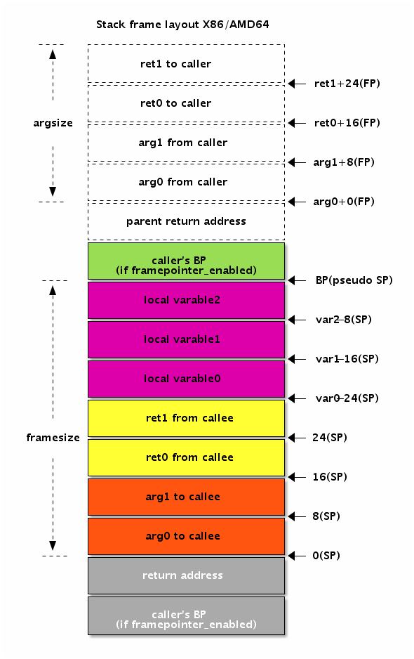

# 3.6 再论函数

在前面的章节中我们已经简单讨论过Go的汇编函数，但是那些主要是叶子函数。叶子函数的最大特点是不会调用其他函数，也就是栈的大小是可以预期的，叶子函数也就是可以基本忽略爆栈的问题（如果已经爆了，那也是上级函数的问题）。如果没有爆栈问题，那么也就是不会有栈的分裂问题；如果没有栈的分裂也就不需要移动栈上的指针，也就不会有栈上指针管理的问题。但是是现实中Go语言的函数是可以任意深度调用的，永远不用担心爆栈的风险。那么这些近似黑科技的特性是如何通过低级的汇编语言实现的呢？这些都是本节尝试讨论的问题。


## 3.6.1 函数调用规范

在Go汇编语言中CALL指令用于调用函数，RET指令用于从调用函数返回。但是CALL和RET指令并没有处理函数调用时输入参数和返回值的问题。CALL指令类似`PUSH IP`和`JMP somefunc`两个指令的组合，首先将当前的IP指令寄存器的值压入栈中，然后通过JMP指令将要调用函数的地址写入到IP寄存器实现跳转。而RET指令则是和CALL相反的操作，基本和`POP IP`指令等价，也就是将执行CALL指令时保存在SP中的返回地址重新载入到IP寄存器，实现函数的返回。

和C语言函数不同，Go语言函数的参数和返回值完全通过栈传递。下面是Go函数调用时栈的布局图：



*图 3-13 函数调用参数布局*


首先是调用函数前准备的输入参数和返回值空间。然后CALL指令将首先触发返回地址入栈操作。在进入到被调用函数内之后，汇编器自动插入了BP寄存器相关的指令，因此BP寄存器和返回地址是紧挨着的。再下面就是当前函数的局部变量的空间，包含再次调用其它函数需要准备的调用参数空间。被调用的函数执行RET返回指令时，先从栈恢复BP和SP寄存器，接着取出的返回地址跳转到对应的指令执行。


## 3.6.2 高级汇编语言

Go汇编语言其实是一种高级的汇编语言。在这里高级一词并没有任何褒义或贬义的色彩，而是要强调Go汇编代码和最终真实执行的代码并不完全等价。Go汇编语言中一个指令在最终的目标代码中可能会被编译为其它等价的机器指令。Go汇编实现的函数或调用函数的指令在最终代码中也会被插入额外的指令。要彻底理解Go汇编语言就需要彻底了解汇编器到底插入了哪些指令。

为了便于分析，我们先构造一个禁止栈分裂的printnl函数。printnl函数内部都通过调用runtime.printnl函数输出换行：

```
TEXT ·printnl_nosplit(SB), NOSPLIT, $8
	CALL runtime·printnl(SB)
	RET
```

然后通过`go tool asm -S main_amd64.s`指令查看编译后的目标代码：

```
"".printnl_nosplit STEXT nosplit size=29 args=0xffffffff80000000 locals=0x10
0x0000 00000 (main_amd64.s:5) TEXT "".printnl_nosplit(SB), NOSPLIT	$16
0x0000 00000 (main_amd64.s:5) SUBQ $16, SP

0x0004 00004 (main_amd64.s:5) MOVQ BP, 8(SP)
0x0009 00009 (main_amd64.s:5) LEAQ 8(SP), BP

0x000e 00014 (main_amd64.s:6) CALL runtime.printnl(SB)

0x0013 00019 (main_amd64.s:7) MOVQ 8(SP), BP
0x0018 00024 (main_amd64.s:7) ADDQ $16, SP
0x001c 00028 (main_amd64.s:7) RET
```

输出代码中我们删除了非指令的部分。为了便于讲述，我们将上述代码重新排版，并根据缩进表示相关的功能：

```
TEXT "".printnl(SB), NOSPLIT, $16
	SUBQ $16, SP
		MOVQ BP, 8(SP)
		LEAQ 8(SP), BP
			CALL runtime.printnl(SB)
		MOVQ 8(SP), BP
	ADDQ $16, SP
RET
```

第一层是TEXT指令表示函数开始，到RET指令表示函数返回。第二层是`SUBQ $16, SP`指令为当前函数帧分配16字节的空间，在函数返回前通过`ADDQ $16, SP`指令回收16字节的栈空间。我们谨慎猜测在第二层是为函数多分配了8个字节的空间。那么为何要多分配8个字节的空间呢？再继续查看第三层的指令：开始部分有两个指令`MOVQ BP, 8(SP)`和`LEAQ 8(SP), BP`，首先是将BP寄存器保持到多分配的8字节栈空间，然后将`8(SP)`地址重新保持到了BP寄存器中；结束部分是`MOVQ 8(SP), BP`指令则是从栈中恢复之前备份的前BP寄存器的值。最里面第四次层才是我们写的代码，调用runtime.printnl函数输出换行。

如果去掉NOSPILT标志，再重新查看生成的目标代码，会发现在函数的开头和结尾的地方又增加了新的指令。下面是经过缩进格式化的结果：

```
TEXT "".printnl_nosplit(SB), $16
L_BEGIN:
	MOVQ (TLS), CX
	CMPQ SP, 16(CX)
	JLS  L_MORE_STK

		SUBQ $16, SP
			MOVQ BP, 8(SP)
			LEAQ 8(SP), BP
				CALL runtime.printnl(SB)
			MOVQ 8(SP), BP
		ADDQ $16, SP

L_MORE_STK:
	CALL runtime.morestack_noctxt(SB)
	JMP  L_BEGIN
RET
```

其中开头有三个新指令，`MOVQ (TLS), CX`用于加载g结构体指针，然后第二个指令`CMPQ SP, 16(CX)`SP栈指针和g结构体中stackguard0成员比较，如果比较的结果小于0则跳转到结尾的L_MORE_STK部分。当获取到更多栈空间之后，通过`JMP L_BEGIN`指令跳转到函数的开始位置重新进行栈空间的检测。

g结构体在`$GOROOT/src/runtime/runtime2.go`文件定义，开头的结构成员如下：

```go
type g struct {
	// Stack parameters.
	stack       stack   // offset known to runtime/cgo
	stackguard0 uintptr // offset known to liblink
	stackguard1 uintptr // offset known to liblink

	...
}
```

第一个成员是stack类型，表示当前栈的开始和结束地址。stack的定义如下：

```go
// Stack describes a Go execution stack.
// The bounds of the stack are exactly [lo, hi),
// with no implicit data structures on either side.
type stack struct {
	lo uintptr
	hi uintptr
}
```

在g结构体中的stackguard0成员是出现爆栈前的警戒线。stackguard0的偏移量是16个字节，因此上述代码中的`CMPQ SP, 16(AX)`表示将当前的真实SP和爆栈警戒线比较，如果超出警戒线则表示需要进行栈扩容，也就是跳转到L_MORE_STK。在L_MORE_STK标号处，先调用runtime·morestack_noctxt进行栈扩容，然后又跳回到函数的开始位置，此时此刻函数的栈已经调整了。然后再进行一次栈大小的检测，如果依然不足则继续扩容，直到栈足够大为止。

以上是栈的扩容，但是栈的收缩是在何时处理的呢？我们知道Go运行时会定期进行垃圾回收操作，这其中包含栈的回收工作。如果栈使用到比例小于一定到阈值，则分配一个较小到栈空间，然后将栈上面到数据移动到新的栈中，栈移动的过程和栈扩容的过程类似。


## 3.6.3 PCDATA和FUNCDATA

Go语言中有个runtime.Caller函数可以获取当前函数的调用者列表。我们可以非常容易在运行时定位每个函数的调用位置，以及函数的调用链。因此在panic异常或用log输出信息时，可以精确定位代码的位置。

比如以下代码可以打印程序的启动流程：

```go
func main() {
	for skip := 0; ; skip++ {
		pc, file, line, ok := runtime.Caller(skip)
		if !ok {
			break
		}

		p := runtime.FuncForPC(pc)
		fnfile, fnline := p.FileLine(0)

		fmt.Printf("skip = %d, pc = 0x%08X\n", skip, pc)
		fmt.Printf("  func: file = %s, line = L%03d, name = %s, entry = 0x%08X\n", fnfile, fnline, p.Name(), p.Entry())
		fmt.Printf("  call: file = %s, line = L%03d\n", file, line)
	}
}
```

其中runtime.Caller先获取当时的PC寄存器值，以及文件和行号。然后根据PC寄存器表示的指令位置，通过runtime.FuncForPC函数获取函数的基本信息。Go语言是如何实现这种特性的呢？

Go语言作为一门静态编译型语言，在执行时每个函数的地址都是固定的，函数的每条指令也是固定的。如果针对每个函数和函数的每个指令生成一个地址表格（也叫PC表格），那么在运行时我们就可以根据PC寄存器的值轻松查询到指令当时对应的函数和位置信息。而Go语言也是采用类似的策略，只不过地址表格经过裁剪，舍弃了不必要的信息。因为要在运行时获取任意一个地址的位置，必然是要有一个函数调用，因此我们只需要为函数的开始和结束位置，以及每个函数调用位置生成地址表格就可以了。同时地址是有大小顺序的，在排序后可以通过只记录增量来减少数据的大小；在查询时可以通过二分法加快查找的速度。

在汇编中有个PCDATA用于生成PC表格，PCDATA的指令用法为：`PCDATA tableid, tableoffset`。PCDATA有个两个参数，第一个参数为表格的类型，第二个是表格的地址。在目前的实现中，有PCDATA_StackMapIndex和PCDATA_InlTreeIndex两种表格类型。两种表格的数据是类似的，应该包含了代码所在的文件路径、行号和函数的信息，只不过PCDATA_InlTreeIndex用于内联函数的表格。

此外对于汇编函数中返回值包含指针的类型，在返回值指针被初始化之后需要执行一个GO_RESULTS_INITIALIZED指令：

```c
#define GO_RESULTS_INITIALIZED	PCDATA $PCDATA_StackMapIndex, $1
```

GO_RESULTS_INITIALIZED记录的也是PC表格的信息，表示PC指针越过某个地址之后返回值才完成被初始化的状态。

Go语言二进制文件中除了有PC表格，还有FUNC表格用于记录函数的参数、局部变量的指针信息。FUNCDATA指令和PCDATA的格式类似：`FUNCDATA tableid, tableoffset`，第一个参数为表格的类型，第二个是表格的地址。目前的实现中定义了三种FUNC表格类型：FUNCDATA_ArgsPointerMaps表示函数参数的指针信息表，FUNCDATA_LocalsPointerMaps表示局部指针信息表，FUNCDATA_InlTree表示被内联展开的指针信息表。通过FUNC表格，Go语言的垃圾回收器可以跟踪全部指针的生命周期，同时根据指针指向的地址是否在被移动的栈范围来确定是否要进行指针移动。

在前面递归函数的例子中，我们遇到一个NO_LOCAL_POINTERS宏。它的定义如下：

```c
#define FUNCDATA_ArgsPointerMaps 0 /* garbage collector blocks */
#define FUNCDATA_LocalsPointerMaps 1
#define FUNCDATA_InlTree 2

#define NO_LOCAL_POINTERS FUNCDATA $FUNCDATA_LocalsPointerMaps, runtime·no_pointers_stackmap(SB)
```

因此NO_LOCAL_POINTERS宏表示的是FUNCDATA_LocalsPointerMaps对应的局部指针表格，而runtime·no_pointers_stackmap是一个空的指针表格，也就是表示函数没有指针类型的局部变量。

PCDATA和FUNCDATA的数据一般是由编译器自动生成的，手工编写并不现实。如果函数已经有Go语言声明，那么编译器可以自动输出参数和返回值的指针表格。同时所有的函数调用一般是对应CALL指令，编译器也是可以辅助生成PCDATA表格的。编译器唯一无法自动生成是函数局部变量的表格，因此我们一般要在汇编函数的局部变量中谨慎使用指针类型。

对于PCDATA和FUNCDATA细节感兴趣的同学可以尝试从debug/gosym包入手，参考包的实现和测试代码。

## 3.6.4 方法函数

Go语言中方法函数和全局函数非常相似，比如有以下的方法：

```go
package main

type MyInt int

func (v MyInt) Twice() int {
	return int(v)*2
}

func MyInt_Twice(v MyInt) int {
	return int(v)*2
}
```

其中MyInt类型的Twice方法和MyInt_Twice函数的类型是完全一样的，只不过Twice在目标文件中被修饰为`main.MyInt.Twice`名称。我们可以用汇编实现该方法函数：

```
// func (v MyInt) Twice() int
TEXT ·MyInt·Twice(SB), NOSPLIT, $0-16
	MOVQ a+0(FP), AX   // v
	ADDQ AX, AX        // AX *= 2
	MOVQ AX, ret+8(FP) // return v
	RET
```

不过这只是接收非指针类型的方法函数。现在增加一个接收参数是指针类型的Ptr方法，函数返回传入的指针：

```go
func (p *MyInt) Ptr() *MyInt {
	return p
}
```

在目标文件中，Ptr方法名被修饰为`main.(*MyInt).Ptr`，也就是对应汇编中的`·(*MyInt)·Ptr`。不过在Go汇编语言中，星号和小括弧都无法用作函数名字，也就是无法用汇编直接实现接收参数是指针类型的方法。

在最终的目标文件中的标识符名字中还有很多Go汇编语言不支持的特殊符号（比如`type.string."hello"`中的双引号），这导致了无法通过手写的汇编代码实现全部的特性。或许是Go语言官方故意限制了汇编语言的特性。

## 3.6.5 递归函数: 1到n求和

递归函数是比较特殊的函数，递归函数通过调用自身并且在栈上保存状态，这可以简化很多问题的处理。Go语言中递归函数的强大之处是不用担心爆栈问题，因为栈可以根据需要进行扩容和收缩。

首先通过Go递归函数实现一个1到n的求和函数：

```go
// sum = 1+2+...+n
// sum(100) = 5050
func sum(n int) int {
	if n > 0 { return n+sum(n-1) } else { return 0 }
}
```

然后通过if/goto重构上面的递归函数，以便于转义为汇编版本：

```go
func sum(n int) (result int) {
	var AX = n
	var BX int

	if n > 0 { goto L_STEP_TO_END }
	goto L_END

L_STEP_TO_END:
	AX -= 1
	BX = sum(AX)

	AX = n // 调用函数后, AX重新恢复为n
	BX += AX

	return BX

L_END:
	return 0
}
```

在改写之后，递归调用的参数需要引入局部变量，保存中间结果也需要引入局部变量。而通过栈来保存中间的调用状态正是递归函数的核心。因为输入参数也在栈上，所以我们可以通过输入参数来保存少量的状态。同时我们模拟定义了AX和BX寄存器，寄存器在使用前需要初始化，并且在函数调用后也需要重新初始化。

下面继续改造为汇编语言版本：

```
// func sum(n int) (result int)
TEXT ·sum(SB), NOSPLIT, $16-16
	MOVQ n+0(FP), AX       // n
	MOVQ result+8(FP), BX  // result

	CMPQ AX, $0            // test n - 0
	JG   L_STEP_TO_END     // if > 0: goto L_STEP_TO_END
	JMP  L_END             // goto L_STEP_TO_END

L_STEP_TO_END:
	SUBQ $1, AX            // AX -= 1
	MOVQ AX, 0(SP)         // arg: n-1
	CALL ·sum(SB)          // call sum(n-1)
	MOVQ 8(SP), BX         // BX = sum(n-1)

	MOVQ n+0(FP), AX       // AX = n
	ADDQ AX, BX            // BX += AX
	MOVQ BX, result+8(FP)  // return BX
	RET

L_END:
	MOVQ $0, result+8(FP) // return 0
	RET
```

在汇编版本函数中并没有定义局部变量，只有用于调用自身的临时栈空间。因为函数本身的参数和返回值有16个字节，因此栈帧的大小也为16字节。L_STEP_TO_END标号部分用于处理递归调用，是函数比较复杂的部分。L_END用于处理递归终结的部分。

调用sum函数的参数在`0(SP)`位置，调用结束后的返回值在`8(SP)`位置。在函数调用之后要需要重新为需要的寄存器注入值，因为被调用的函数内部很可能会破坏了寄存器的状态。同时调用函数的参数值也是不可信任的，输入参数值也可能在被调用函数内部被修改了。

总得来说用汇编实现递归函数和普通函数并没有什么区别，当然是在没有考虑爆栈的前提下。我们的函数应该可以对较小的n进行求和，但是当n大到一定程度，也就是栈达到一定的深度，必然会出现爆栈的问题。爆栈是C语言的特性，不应该在哪怕是Go汇编语言中出现。

Go语言的编译器在生成函数的机器代码时，会在开头插入一小段代码。因为sum函数也需要深度递归调用，因此我们删除了NOSPLIT标志，让汇编器为我们自动生成一个栈扩容的代码：

```
// func sum(n int) int
TEXT ·sum(SB), $16-16
	NO_LOCAL_POINTERS

	// 原来的代码
```

除了去掉了NOSPLIT标志，我们还在函数开头增加了一个NO_LOCAL_POINTERS语句，该语句表示函数没有局部指针变量。栈的扩容必然要涉及函数参数和局部编指针的调整，如果缺少局部指针信息将导致扩容工作无法进行。不仅仅是栈的扩容需要函数的参数和局部指针标记表格，在GC进行垃圾回收时也将需要。函数的参数和返回值的指针状态可以通过在Go语言中的函数声明中获取，函数的局部变量则需要手工指定。因为手工指定指针表格是一个非常繁琐的工作，因此一般要避免在手写汇编中出现局部指针。

喜欢深究的读者可能会有一个问题：如果进行垃圾回收或栈调整时，寄存器中的指针是如何维护的？前文说过，Go语言的函数调用是通过栈进行传递参数的，并没有使用寄存器传递参数。同时函数调用之后所有的寄存器视为失效。因此在调整和维护指针时，只需要扫描内存中的指针数据，寄存器中的数据在垃圾回收器函数返回后都需要重新加载，因此寄存器是不需要扫描的。

## 3.6.6 闭包函数

闭包函数是最强大的函数，因为闭包函数可以捕获外层局部作用域的局部变量，因此闭包函数本身就具有了状态。从理论上来说，全局的函数也是闭包函数的子集，只不过全局函数并没有捕获外层变量而已。

为了理解闭包函数如何工作，我们先构造如下的例子：

```go
package main

func NewTwiceFunClosure(x int) func() int {
	return func() int {
		x *= 2
		return x
	}
}

func main() {
	fnTwice := NewTwiceFunClosure(1)

	println(fnTwice()) // 1*2 => 2
	println(fnTwice()) // 2*2 => 4
	println(fnTwice()) // 4*2 => 8
}
```

其中`NewTwiceFunClosure`函数返回一个闭包函数对象，返回的闭包函数对象捕获了外层的`x`参数。返回的闭包函数对象在执行时，每次将捕获的外层变量乘以2之后再返回。在`main`函数中，首先以1作为参数调用`NewTwiceFunClosure`函数构造一个闭包函数，返回的闭包函数保存在`fnTwice`闭包函数类型的变量中。然后每次调用`fnTwice`闭包函数将返回翻倍后的结果，也就是：2，4，8。

上述的代码，从Go语言层面是非常容易理解的。但是闭包函数在汇编语言层面是如何工作的呢？下面我们尝试手工构造闭包函数来展示闭包的工作原理。首先是构造`FunTwiceClosure`结构体类型，用来表示闭包对象：

```go
type FunTwiceClosure struct {
	F uintptr
	X int
}

func NewTwiceFunClosure(x int) func() int {
	var p = &FunTwiceClosure{
		F: asmFunTwiceClosureAddr(),
		X: x,
	}
	return ptrToFunc(unsafe.Pointer(p))
}
```

`FunTwiceClosure`结构体包含两个成员，第一个成员`F`表示闭包函数的函数指令的地址，第二个成员`X`表示闭包捕获的外部变量。如果闭包函数捕获了多个外部变量，那么`FunTwiceClosure`结构体也要做相应的调整。然后构造`FunTwiceClosure`结构体对象，其实也就是闭包函数对象。其中`asmFunTwiceClosureAddr`函数用于辅助获取闭包函数的函数指令的地址，采用汇编语言实现。最后通过`ptrToFunc`辅助函数将结构体指针转为闭包函数对象返回，该函数也是通过汇编语言实现。

汇编语言实现了以下三个辅助函数：

```go
func ptrToFunc(p unsafe.Pointer) func() int

func asmFunTwiceClosureAddr() uintptr
func asmFunTwiceClosureBody() int
```

其中`ptrToFunc`用于将指针转化为`func() int`类型的闭包函数，`asmFunTwiceClosureAddr`用于返回闭包函数机器指令的开始地址（类似全局函数的地址），`asmFunTwiceClosureBody`是闭包函数对应的全局函数的实现。

然后用Go汇编语言实现以上三个辅助函数：

```s
#include "textflag.h"

TEXT ·ptrToFunc(SB), NOSPLIT, $0-16
	MOVQ ptr+0(FP), AX // AX = ptr
	MOVQ AX, ret+8(FP) // return AX
	RET

TEXT ·asmFunTwiceClosureAddr(SB), NOSPLIT, $0-8
	LEAQ ·asmFunTwiceClosureBody(SB), AX // AX = ·asmFunTwiceClosureBody(SB)
	MOVQ AX, ret+0(FP)                   // return AX
	RET

TEXT ·asmFunTwiceClosureBody(SB), NOSPLIT|NEEDCTXT, $0-8
	MOVQ 8(DX), AX
	ADDQ AX   , AX        // AX *= 2
	MOVQ AX   , 8(DX)     // ctx.X = AX
	MOVQ AX   , ret+0(FP) // return AX
	RET
```

其中`·ptrToFunc`和`·asmFunTwiceClosureAddr`函数的实现比较简单，我们不再详细描述。最重要的是`·asmFunTwiceClosureBody`函数的实现：它有一个`NEEDCTXT`标志。采用`NEEDCTXT`标志定义的汇编函数表示需要一个上下文环境，在AMD64环境下是通过`DX`寄存器来传递这个上下文环境指针，也就是对应`FunTwiceClosure`结构体的指针。函数首先从`FunTwiceClosure`结构体对象取出之前捕获的`X`，将`X`乘以2之后写回内存，最后返回修改之后的`X`的值。

如果是在汇编语言中调用闭包函数，也需要遵循同样的流程：首先为构造闭包对象，其中保存捕获的外层变量；在调用闭包函数时首先要拿到闭包对象，用闭包对象初始化`DX`，然后从闭包对象中取出函数地址并用通过`CALL`指令调用。

